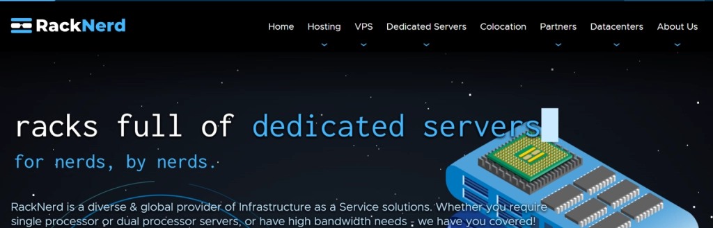
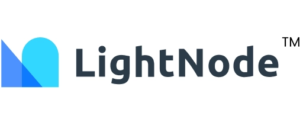
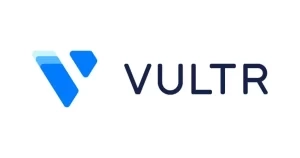

# 美国VPS怎么选？2025年速度快、价格低、线路稳的美国VPS盘点

美国VPS市场鱼龙混杂，新手最头疼的就是：到底哪家速度快、线路稳，价格还不贵？

说实话，这三个条件看似难以兼得，但好消息是——确实有这样的服务商存在。对于国内用户来说，选对线路是关键：电信CN2、联通AS4837/AS9929、移动AS58807都是不错的选择。下面我整理了10家值得考虑的美国VPS服务商，每家都有各自的特点和适用场景。

---

## 1、搬瓦工VPS - 老牌CN2 GIA专家

搬瓦工（BandwagonHost）成立于2004年，算是这个行业的老前辈了。它家最大的特点是专注高端线路，三网强制走CN2 GIA。

如果你不太懂什么是CN2 GIA，可以这么理解：普通线路是挤公交，CN2是坐高铁，而CN2 GIA就是坐高铁商务座。电信把这条线路当SVIP在维护，带宽给到2.5G~10Gbps。

**推荐套餐：**
- **入门选择**：$49.99/年，1GB内存+20GB SSD，日本软银机房，月流量1TB
- **性能均衡**：CN2 GIA-E季付$49.99起，年付$169.99，2.5Gbps带宽，支持11个机房随意切换
- **高端配置**：香港CN2 GIA年付$899.99起，适合企业级应用

搬瓦工的促销套餐经常秒光，感兴趣要抓紧。除了美国机房，还覆盖香港CMI、澳大利亚、加拿大、荷兰等14个节点。

## 2、LisaHost 丽萨主机 - 双ISP住宅IP专家

丽萨主机2017年成立，主打一个"线路全"——三网CN2 GIA、AS9929、AS4837、国际BGP都有。

它家最特别的是提供双ISP、住宅IP和原生IP，特别适合需要解锁流媒体、做电商或游戏加速的场景。支持Windows系统，48小时内不满意可以无条件退款，这点比较厚道。

**主推服务：**
- 美国双ISP住宅原生IP（三网回程AS4837优化，最高1Gbps带宽）
- 覆盖美国、日本、英国、香港、新加坡、韩国、台湾等地区
- 支持支付宝/USDT支付

如果你需要原生IP做特定业务，丽萨主机值得考虑。

## 3、RackNerd - 性价比之王

RackNerd是2019年新星，主打一个字：便宜。年付套餐最低$10.18起，但别以为便宜就不行——机房选择多（洛杉矶、圣何塞、西雅图、达拉斯、纽约、芝加哥、亚特兰大和爱尔兰），而且支持自助换IP。

对于预算有限又想尝试美国VPS的用户来说，RackNerd是个不错的入门选择。支持支付宝、PayPal和信用卡付款。

**特点：**
- 七大数据中心可选
- 支持扩展IPv4、内存和CPU
- 价格透明，按年计费更划算

## 4、HostWinds - 按需灵活配置

HostWinds在海外口碑不错，主打灵活配置和按需扩展。它家的云服务器性能稳定，价格相比同类产品有优势，而且支持按小时计费。

如果你的业务需求波动比较大，不想长期绑定某个配置，HostWinds的按小时计费模式会比较适合你。

## 5、LightNode - 全球节点最多

LightNode是个香港云服务商，最大优势是节点多——全球40+节点覆盖，包括韩国、美国、巴西、澳大利亚、新加坡、日本、南非等。

**推荐理由：**
- 无需实名、无需备案，邮箱注册即可
- 按小时收费，美国线路VPS低至$0.012/小时
- 随时可换IP，解锁Netflix等流媒体
- 支持ChatGPT访问，适合外贸电商

如果你需要快速测试不同地区的网络环境，或者经常需要换IP，LightNode会很方便。👉 [想了解更多稳定高速的全球VPS服务？Vultr提供17个数据中心选择，按需付费更灵活](https://www.vultr.com/?ref=9738262-9J)

## 6、Hostinger - AI助手加持

Hostinger是美国老牌主机商，VPS采用NVMe SSD存储，性能稳定。它家比较特别的是提供AI助手，帮你更简单地管理VPS。

**特点：**
- 支持Linux操作系统
- 数据中心分布：美国、巴西、法国、立陶宛和印度
- 免费实时快照+每周自动备份

对新手来说，有AI助手帮忙确实能省不少事。

## 7、萤光云 - 安全可靠的选择

萤光云主打安全可靠，完善的安全机制+强大的计算能力+灵活的扩展性，三者兼顾。技术支持和售后服务也比较到位。

如果你对安全性要求比较高，或者需要专业的技术支持，可以考虑萤光云。

## 8、DMIT - 打不死的小强

DMIT成立于2018年，和搬瓦工一样主打CN2 GIA线路，但区别在于——DMIT带高防，号称"打不死的小强"。

如果你的业务经常遇到DDoS攻击，或者对网络稳定性要求极高，DMIT的高防CN2 GIA方案值得考虑。每次促销也是秒光的节奏。

**主推：**
- 美国洛杉矶三网CN2 GIA VPS
- KVM虚拟化
- 自带DDoS防御

## 9、六六云666clouds - 双ISP住宅IP专家

六六云2020年成立，主营美国CN2 GIA原生IP、9929、4837线路，以及英国住宅IP、香港CMI、台湾原生IP、日本软银、韩国原生IP等双ISP住宅IP服务。

**适用场景：**
- TikTok业务
- ChatGPT访问
- 需要原生IP的各类应用

支持支付宝付款，价格相对便宜。目前有货的套餐可以直接去官网查看。

## 10、Vultr - 按小时计费的灵活选择

Vultr在国内用户中口碑不错。亚洲机房包括日本东京、韩国首尔、新加坡节点，网络线路表现稳定。

**特点：**
- 最低$2.5/月起（仅IPv6）
- 实用套餐从$3.5/月起
- 按小时计费，随用随停
- 换IP只需删除旧机器重开即可
- 新用户经常有$20~$100的赠金活动

Vultr的按小时计费模式特别适合测试或临时需求，用多少算多少，不用的时候直接删除，余额退回账户。

---

选择美国VPS，关键是要明确自己的需求：是追求极致速度还是性价比？需要原生IP还是普通IP就够？业务量大不大？搞清楚这些，再对照上面的服务商特点，基本就能找到适合自己的那一款。👉 [需要更多全球节点和灵活配置？试试Vultr的云服务器，新用户还有优惠](https://www.vultr.com/?ref=9738262-9J)

如果预算充足追求稳定，搬瓦工和DMIT是首选；如果追求性价比，RackNerd和Vultr值得考虑；如果需要特殊IP类型，丽萨主机和六六云可以满足你。最重要的是，大部分服务商都支持按小时或短期计费，可以先小额测试，满意再长期使用。
